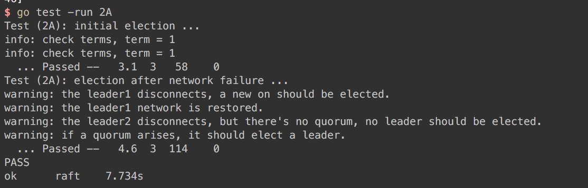

> [Lab2 Raft content](http://nil.csail.mit.edu/6.824/2018/labs/lab-raft.html)  
> You should consult the [extended Raft paper](https://raft.github.io/raft.pdf) and [the Raft lecture notes](http://nil.csail.mit.edu/6.824/2018/notes/l-raft.txt).  
> 因为毕设是做的分布式 kv 相关，论文自然也会写到 raft，所以原理部分担心论文查重问题，暂且搁置，等毕设搞完放出。下面主要说说实验内容，调试方案，遇到的坑   
> **具体代码见 [branch: Lab_Raft](https://github.com/polebug/MIT6.824_2018/tree/Lab2_Raft)** 

## 实验内容

2A 的目标是实现选主机制和心跳，测试中包含了两个测试用例：  
1. `TestInitialElection2A`：模拟集群网络正常的情况
2. `TestReElection2A`：模拟节点网络异常的情况，具体测试流程是：
	选举出 leader1 -> leader1 发生网络分区 -> 要求选举出 leader2 -> leader1 网络恢复，要求不打扰 leader2 -> leader2 和 另外一个节点发生网络分区 -> 要求新一轮选举不成功，出现 splite vote -> 其中一个节点网络恢复 -> 要求选举出新的 leader


## 调试方案

因为此实验涉及过多的并发，调试起来有一些困难。我是这样打日志的：
1. 在测试代码中打日志：打出每一次的网络更变时机，例如：
	
2. 在 raft 实现代码中，打印出所有关键节点日志，比如：节点状态更变，rpc收发情况

建议阅读测试代码，这样做有利于在调试过程中，找到一些线索

## 遇到的坑

### 1. rpc 响应时长不固定

这是一个藏得很深的坑，只有多分析日志才能发现，labrpc 中设定的 rpc 返回时长是不固定的

翻了 `labrpc.go` 代码，发现在 `func (rn *Network) ProcessReq(req reqMsg)` 中设置了 rpc 返回时长为 0~2000ms

```go
if replyOK == false || serverDead == true {
	// server was killed while we were waiting; return error.
	req.replyCh <- replyMsg{false, nil}
} else if reliable == false && (rand.Int()%1000) < 100 {
	// drop the reply, return as if timeout
	req.replyCh <- replyMsg{false, nil}
} else if longreordering == true && rand.Intn(900) < 600 {
	// delay the response for a while
	ms := 200 + rand.Intn(1+rand.Intn(2000))
	// Russ points out that this timer arrangement will decrease
	// the number of goroutines, so that the race
	// detector is less likely to get upset.
	time.AfterFunc(time.Duration(ms)*time.Millisecond, func() {
		req.replyCh <- reply
	})
} else {
	req.replyCh <- reply
}
```

rpc 返回时长不固定就会导致，如果出现 splite vote 的情况，可能在测试的时间范围内来不及选举出新的 leader。

如果你碰上测试时而能过，时而报错的现象，需要特别注意这一点。

**解决办法**：  
不死等 rpc 返回，默认超过 500ms 就认为 rpc 响应超时

**实现方式**:  
利用 select 和 time.After，rpc 响应的等待时间最长为 500ms，超过 500ms 立刻返回  

需要注意的是，如果这个节点发生了网络分区，调用 Call 之后会直接返回 ok = false，对于 rpc 响应结果，这里就出现了三种情况：超时、不可用、正常。不管是投票还是日志复制，都应该只接受「RPC 响应正常」的数据，如果不加以区分，会导致赋值出现问题。

以下代码示例为 SendRequestVote 
```go
func (rf *Raft) SendRequestVote(server int, args *RequestVoteArgs, reply *RequestVoteReply) int {
	var okCh = make(chan bool)

	go func() {
		var ok = rf.peers[server].Call("Raft.RequestVote", args, reply)
		okCh <- ok
	}()

	select {
	case <-time.After(RPC_TIMEOUT):
		return labrpc.DEADLINE_EXCEEDED
	case ok := <-okCh:
		if ok {
			return labrpc.OK
		}
		return labrpc.UNAVAILABLE
	}
}
```

### 2. 共享变量

这个 lab 中有大量的并发，且需要访问全局共享变量，这就需要在每次读写共享数据的地方加上锁。为了不过于影响性能，我们不应该在`Go关键字`之前仍持有锁，防止造成阻塞。

读写共享变量的地方都锁上了，还是会有一些问题，比如 heartbeat 中：
```go
func (rf *Raft) Broadcast() {
	for true {
		for idxPeer := range rf.peers {
			rf.mu.Lock()
			if rf.state != LEADER {
				rf.mu.Unlock()
				return
			}

			if idxPeer == rf.me {
				rf.InitElectionConf()
				rf.mu.Unlock()
				continue
			}
			rf.mu.Unlock()

			go func(server int) {
				rf.mu.Lock()
				var (
					appendReq = AppendEntriesArgs{
						LeaderID:     rf.me,
						Term:         rf.CurrentTerm,
					}
					appendResp = AppendEntriesReply{}
				)
				rf.mu.Unlock()

				SendAppendEntries...
			}
		}
	}
}
```

这段代码是有问题的，heartbeat 的发送者必须保证是 leader，虽然在启用 goroutine 之前校验过发送方的身份了，但是在 goroutine 内部读到的 raft state 并不一定还是 leader，这种潜在的危险会导致其他节点收到了非leader节点所发的心跳，节点的状态也就发生了错乱。

**解决办法**:  
在 goroutine 内部再次校验节点是否是 leader

如果发现不了这类问题，可以把每个地方的读写情况打印出来，仔细校验。


### 简单谈谈代码实现

> **详细代码见：[branch: Lab_Raft](https://github.com/polebug/MIT6.824_2018/tree/Lab2_Raft)**，上面有详细注释

简单说说代码结构，我把原本的 `raft.go` 拆成了三部分：
```go
raft.go // raft 算法的内部逻辑
rpc.go // raft 节点之间的 rpc 调用层
server.go // raft server, 与上层 kv server 交互的中间层
```

其中 `raft.go` 的主要函数有：
```go
func (rf *Raft) persist() // 持久化
func (rf *Raft) readPersist(data []byte) // 读入持久化数据
func (rf *Raft) SetFollower(term int) // 将节点状态置为 follower
func (rf *Raft) SetCandidate() // 将节点状态置为 candidate
func (rf *Raft) SetLeader() // 将节点状态置为 leader
func (rf *Raft) InitElectionConf() // 初始化超时选举
func (rf *Raft) ElectionTimeOut() // 开始超时选举
func (rf *Raft) StartElection() // 开始选举
func (rf *Raft) Broadcast() // leader广播，用于心跳和日志复制
func (rf *Raft) CheckCommit() // leader检测日志是否已复制到大多数节点上
func (rf *Raft) WaitCmdApplied() // 检测是否有新的已提交日志需要执行
```

`rpc.go` 中包括：
```golang
func (rf *Raft) SendRequestVote(server int, args *RequestVoteArgs, reply *RequestVoteReply) (code int) // 发送请求投票 rpc
func (rf *Raft) RequestVote(args *RequestVoteArgs, reply *RequestVoteReply) // 投票

func (rf *Raft) SendAppendEntries(server int, args *AppendEntriesArgs, reply *AppendEntriesReply) (code int) // 发送日志复制(heartbeat) rpc 
func (rf *Raft) AppendEntries(args *AppendEntriesArgs, reply *AppendEntriesReply) // 日志复制&heartbeat
```

`server.go` 中包括：
```go
func (rf *Raft) GetState() (term int, isleader bool) // 获取节点的 term，是否是 leacer
func (rf *Raft) Start(command interface{}) (index int, term int, isLeader bool) // 给 leader 节点添加一个新的指令
func Make(peers []*labrpc.ClientEnd, me int, persister *Persister, applyCh chan ApplyMsg） *Raft // 创建一个raft节点 
```


