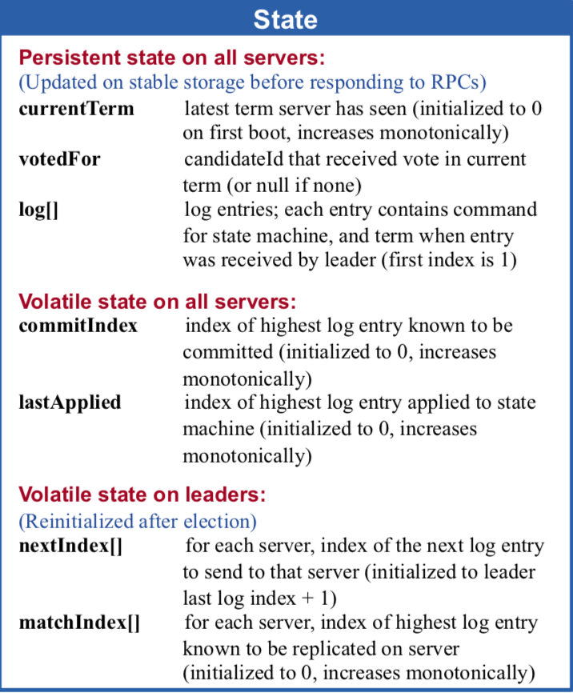
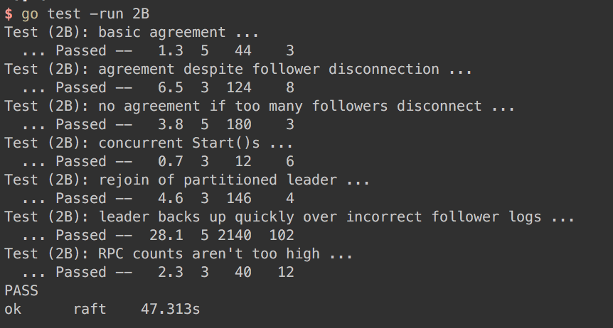

> [Lab2 Raft content](http://nil.csail.mit.edu/6.824/2018/labs/lab-raft.html)  
> You should consult the [extended Raft paper](https://raft.github.io/raft.pdf) and [the Raft lecture notes](http://nil.csail.mit.edu/6.824/2018/notes/l-raft.txt).  
> 因为毕设是做的分布式 kv 相关，论文自然也会写到 raft，所以原理部分担心论文查重问题，暂且搁置，等毕设搞完放出。下面主要说说实验内容，调试方案，遇到的坑  
> **具体代码见 [branch: Lab_Raft](https://github.com/polebug/MIT6.824_2018/tree/Lab2_Raft)**

## 实验内容

2B 的实验目标是实现日志复制，保证同一任期内所有节点的日志一致，且具备一定的容错性

测试用例中，覆盖了这几种情况：
1. `TestBasicAgree2B()`: 在集群网络均正常下，日志一致
2. `TestFailAgree2B()`: 少部分节点发生网络分区，其余节点能正常 commit 和 apply，网络恢复之后，所有节点日志保持一致
3. `TestFailNoAgree2B()`: 大部分(>1/2)节点发生网络分区，其余节点无法 commit 日志，当大部分节点网络正常之后，能根据日志新旧(选举限制)，选举出 leader
4. `TestConcurrentStarts2B()`: 模拟客户端并发发送多个命令
5. `TestRejoin2B()`: 处理日志冲突的情况，存在过期 leader uncommitted 的日志
6. `TestBackup2B()`: 压测
7. `TestCount2B()`: 检查无效的 RPC 调用次数


## 遇到的坑

### 1. index 边界问题

日志复制涉及到很多 index，例如 raft 共享变量就有 `commitIndex, lastApplied, matchIndex, nextIndex`。如果没有考虑好这些变量的初始值，就会得到错误的结果或者直接 panic。

仔细阅读 paper Figure2，可以得到边界问题的答案：  


由 paper 可知，
1. `logs[]` 的初始长度为1，在 Make() 时，应该初始化 `rf.logs = make([]LogEntry, 1)`，而不是初始化为 nil
2. `commitIndex, lastApplied` 的初始值都是 0
3. `nextIndex[]` 的初始值为 `len(rf.logs)`
4. `matchIndex[]` 的初始值为 0

需要特别注意 `logs[], nextIndex[]` 的初始值，如果没有注意到这个细节，会导致 `panic: runtime error: index out of range`。

### 2. AppendEntries RPC 缺少传参

在 Lab2A 中，在 `Broadcast()` 函数中实现了 heartbeat，并行发送 AppendEntries RPC 部分：
```go
go func(server int) {
    // send initial empty AppendEntries RPCs (heartbeat) to each server;
    // repeat during idle periods to prevent election timeouts
    rf.mu.Lock()
    if rf.state != LEADER {
        rf.mu.Unlock()
        return
    }
    var (
        appendReq = AppendEntriesArgs{
            LeaderID:     rf.me,
            Term:         rf.CurrentTerm,
        }
        appendResp = AppendEntriesReply{}
    )
    rf.mu.Unlock()

    if response := rf.SendAppendEntries(server, &appendReq, &appendResp); response == labrpc.OK {
        ...
    }
}
```

是不是可以认为，如果没有新的日志需要复制给 follower，AppendEntries RPC 就只起到了 heartbeat 作用？

这个观点是错误的。follower 节点的 commitIndex 是根据 AppendEntries RPC 中的 `args.LeaderCommit` 更新的。在没有新的日志需要复制的情况下，如果不传 `args.LeaderCommit`，follower 将无法即时知道 leader 把日志标记为 committed，导致节点没有即时 apply 命令。

所以，在传参部分，每次都应该传递
```go
appendReq = AppendEntriesArgs{
    LeaderID:     rf.me,
    Term:         rf.CurrentTerm,
    LeaderCommit: rf.commitIndex,
}
```

这是我在一开始写代码时忽略的细节问题，应该在写代码之前想好每一个细节，避免不必要的 debug

---

测试通过：  
